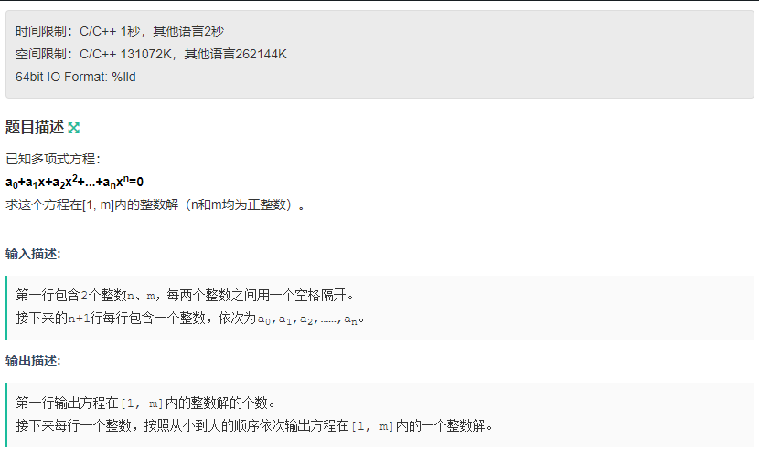

链接：[原题](https://ac.nowcoder.com/acm/problem/16499)


**30% 解法**

```Java
import java.util.LinkedList;
import java.util.List;
import java.util.Scanner;

public class ValidNumber {
    int n,m;
    int[] A;

    private boolean EqualZero(int x){
        double equation;
        equation = A[n];
        for (int i = n; i > 0; i--) {
            equation *= x;
            equation += A[i-1];
            //System.out.println(equation + "' " + A[i]+"d "+ A[i-1]);
        }
        if(equation == 0){
            return true;
        }
        return false;
    }

    public void MultiNomial(){
        Scanner scanner = new Scanner(System.in);
        n = scanner.nextInt();
        m = scanner.nextInt();
        A = new int[n+5];
        for (int i = 0; i < n+1; i++) {
            A[i] = scanner.nextInt();
        }
        scanner.close();

        int cnt = 0;
        List<Integer> ans = new LinkedList<>();
        for (int i = 1; i < m+1; i++) {
            if(EqualZero(i)){
                cnt++;
                ans.add(i);
            }
        }

        System.out.println(cnt);
        for (Integer an : ans){
            System.out.println(an);
        }

    }
    public static void main(String[] args){
        new ValidNumber().MultiNomial();
    }
}

```